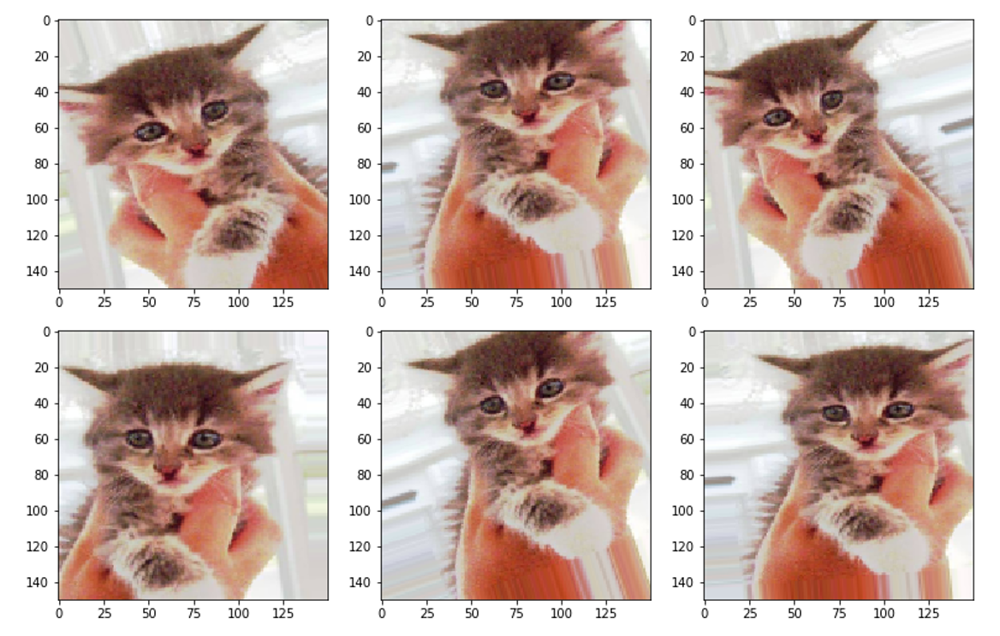
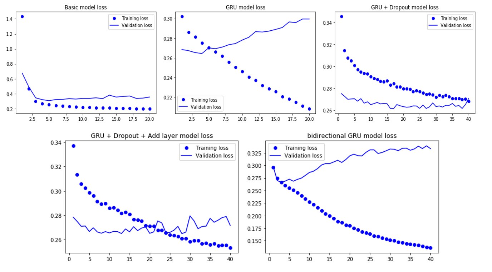

# Keras-Applications

## Contents

1. [CNN_MNIST](https://github.com/newhiwoong/Keras-Applications/blob/master/01_CNN_MNIST.ipynb) : CNN을 이용한 간단한 NMIST 진행  

2. [CNN convnets with small datasets](https://github.com/newhiwoong/Keras-Applications/blob/master/02_CNN_convnets_with_small_datasets.ipynb) : 작은 Datasets의 데이터를 데이터 증식을 통해서 80% 이상의 높은 성능의 분류기 제작

3. [CNN use pretrained VGG16](https://github.com/newhiwoong/Keras-Applications/blob/master/03_CNN_use_pretrained_VGG16.ipynb) : 이미 학습된 VGG16과 위에 데이터 증식을 응용해서 작은 Datasets에서 90%이상의 높은 성능을 갖는 분류기 제작

4. [CNN visualizing what convnets learn](https://github.com/newhiwoong/Keras-Applications/blob/master/03_CNN_use_pretrained_VGG16.ipynb) : convnets learn과정은 시각화와 CAM(Class Activation Map) 시각화를 통해 CNN 과정을 시각적으로 이해하기

5. [RNN word embeddings](https://github.com/newhiwoong/Keras-Applications/blob/master/05_RNN_word_embeddings.ipynb) : one hot encoding제작, GloVe로 word embeddings을 만들어서 IMDB 영화의 긍부정 학습

6. [RNN understanding rnn lstm](https://github.com/newhiwoong/Keras-Applications/blob/master/06_RNN_understanding_rnn_lstm.ipynb) : RNN과 LSTM를 이용하여 IMDB 영화의 긍부정 학습을 하며 RNN과 LSTM의 사용방법 이해하기

7. [RNN advanced usage of rnn](https://github.com/newhiwoong/Keras-Applications/blob/master/07_RNN_advanced_usage_of_rnn.ipynb) : 기온 예측 문제를 통해 RNN의 다양한 사용법 학습을 이해합니다. (recurrent dropout, stacking recurrent layer, bidirectional recurrent layer)

8. [RNN processing with convnets ](https://github.com/newhiwoong/Keras-Applications/blob/master/08_RNN_processing_with_convnets) : 1D convnets을 이용하여 특정 자연어 처리 같은 일부 문제에서 RNN을 대신하는 빠른 모델 제작

## Reference

> [케라스 창시자에게 배우는 딥러닝](https://github.com/rickiepark/deep-learning-with-python-notebooks)  
> 
> [Keras examples directory](https://github.com/keras-team/keras/tree/master/examples)
> 
> [Coursera Sequence Models](https://www.coursera.org/learn/nlp-sequence-models):[Code](https://github.com/newhiwoong/Sequence-Models-coursera)

